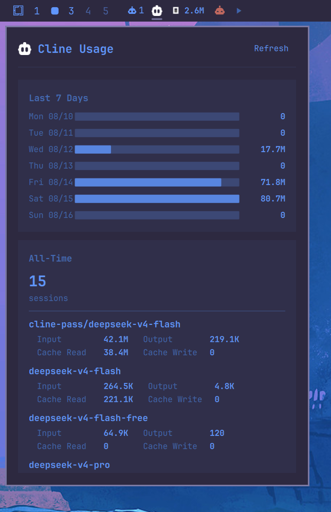

# dizziee.cline-model-usage

Cline token usage stats in the Omarchy bar. Displays today, weekly, and all-time token counts per model.

## Requirements

- Python 3
- Cline (official) https://github.com/cline/cline
  - AUR: `yay -S cline-cli` 
- Cline with existing session data in `~/.cline/data/db/sessions.db`

## Installation

```sh
omarchy plugin add https://github.com/JJDizz1L/dizziee.cline-model-usage.git --enable
```

### Then place it in your bar layout with 
`omarchy bar plugin add dizziee.cline-model-usage [--section <left|center|right>]`</br>

Suggested placement: 
```
omarchy bar plugin add dizziee.cline-model-usage --section left
```
You can validate the plugin at any time with:

```sh
omarchy plugin validate ~/.config/omarchy/plugins/dizziee.cline-model-usage
```

## Configuration
Configuration lives in `~/.config/omarchy/shell.json`.

| Key | Type | Default | Description |
|---|---|---|---|
| `refreshIntervalSec` | integer (30–3600) | 300 | How often to re-query the Cline database (seconds) |

## Preview



## License

MIT
